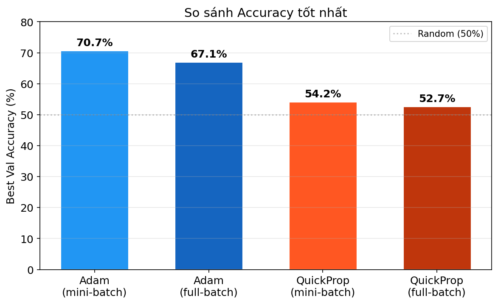
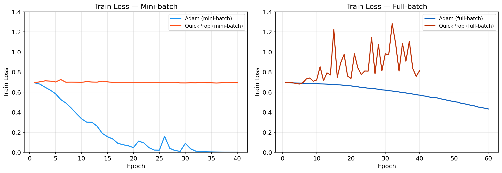
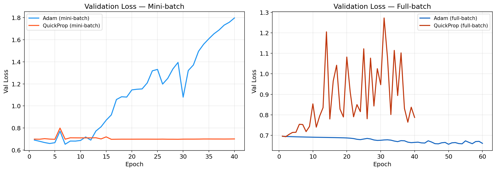
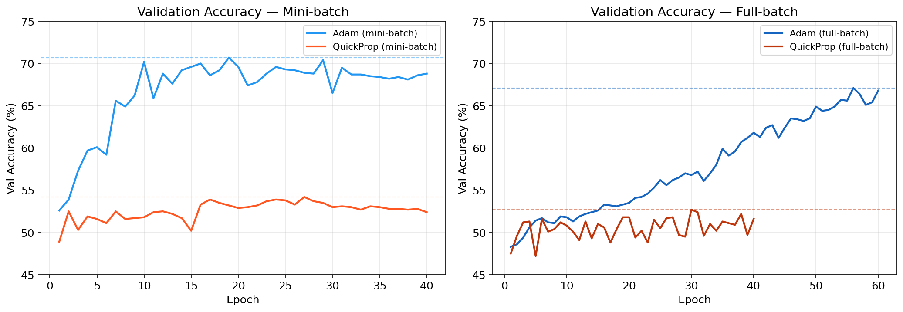

# Phân tích cảm xúc trên tập IMDB bằng LSTM — So sánh Adam và QuickProp

**Môn học:** Toán cho Trí tuệ Nhân tạo  

---

## 1. Giới thiệu bài toán

Phân tích cảm xúc (sentiment analysis) là bài toán phân loại văn bản thành hai lớp: tích cực (positive) và tiêu cực (negative). Bài toán này được sử dụng rộng rãi trong xử lý ngôn ngữ tự nhiên (NLP).

Tập dữ liệu sử dụng là **IMDB Movie Reviews** gồm 50.000 đánh giá phim đã được gán nhãn positive/negative. Thí nghiệm sử dụng **2000 mẫu huấn luyện** và **1000 mẫu kiểm tra**. Mục tiêu chính là so sánh hai phương pháp tối ưu trong hai chế độ huấn luyện khác nhau (mini-batch và full-batch), không nhằm đạt kết quả tối ưu trên tập dữ liệu.

## 2. Mô hình và cách tiếp cận

### 2.1. Kiến trúc mô hình

Mô hình sử dụng là **LSTM (Long Short-Term Memory)** với cấu trúc:

- **Embedding**: vocabulary = 5000, dimension = 32
- **LSTM**: 1 layer, hidden size = 100
- **Fully Connected**: 100 → 1 (hàm kích hoạt sigmoid)
- **Hàm mất mát**: Binary Cross Entropy

Cả hai phương pháp tối ưu đều sử dụng cùng bộ trọng số khởi tạo (seed = 42) để đảm bảo tính công bằng khi so sánh.

### 2.2. Hai chế độ huấn luyện

Thí nghiệm được thực hiện với hai chế độ:

1. **Mini-batch** (`lstm_minibatch.py`): batch size = 64, 40 epochs. Mỗi epoch duyệt qua nhiều mini-batch, cập nhật trọng số sau mỗi batch.
2. **Full-batch** (`lstm_fullbatch.py`): tích lũy gradient trên toàn bộ tập huấn luyện (gradient accumulation với sub-batch = 128 để tiết kiệm bộ nhớ), cập nhật trọng số 1 lần mỗi epoch, 60 epochs.

### 2.3. Hai phương pháp tối ưu

1. **Adam** (Kingma & Ba, 2015) — sử dụng gradient kết hợp momentum bậc nhất, bậc hai và adaptive learning rate.
2. **QuickProp** (Fahlman, 1989) — sử dụng xấp xỉ parabol dựa trên gradient hiện tại và gradient trước đó để xác định bước cập nhật.

## 3. Lý thuyết QuickProp

### 3.1. Nguyên lý

QuickProp xấp xỉ hàm loss theo từng tham số bằng một parabol (đa thức bậc 2) dựa trên gradient tại hai bước liên tiếp. Từ đó xác định đỉnh parabol làm điểm cập nhật tiếp theo.

Giả sử tại bước $t$, ta có:
- $g_t$ — gradient hiện tại
- $g_{t-1}$ — gradient ở bước trước
- $\Delta w^{(t-1)}$ — bước cập nhật trước đó

### 3.2. Công thức cập nhật

$$\Delta w^{(t)} = \frac{g_t}{g_{t-1} - g_t} \cdot \Delta w^{(t-1)}$$

Ý tưởng: nếu coi loss là parabol theo $w$, hai gradient $g_{t-1}$ và $g_t$ xác định được hai điểm trên parabol đó. Tỷ số $\frac{g_t}{g_{t-1} - g_t}$ ước lượng vị trí đỉnh parabol (cực tiểu) dựa trên tốc độ thay đổi gradient.


### 3.3. So sánh với Adam

| Đặc điểm | Adam | QuickProp |
|-----------|------|-----------|
| Loại | Gradient bậc nhất + momentum | Xấp xỉ bậc hai (parabol) |
| Thông tin sử dụng | Gradient + trung bình trượt bậc 1, 2 | Gradient hiện tại + gradient trước |
| Adaptive | Có (per-parameter learning rate) | Có (bước cập nhật tỷ lệ với đường cong loss) |
| Hyperparameter | lr, $\beta_1$, $\beta_2$ | lr, max_delta |

## 4. Kết quả thực nghiệm

### 4.0. Biểu đồ so sánh tổng quan

#### So sánh Accuracy tốt nhất



#### Train Loss theo epoch



#### Validation Loss theo epoch



#### Validation Accuracy theo epoch



### 4.1. Thí nghiệm 1 — Mini-batch (lstm_minibatch.py)

**Cấu hình:** batch size = 64, 40 epochs, cập nhật trọng số mỗi mini-batch.

#### Adam (mini-batch)

| Chỉ số | Giá trị |
|--------|---------|
| Epoch tốt nhất | 19 |
| Val accuracy cao nhất | 70.70% |
| Val loss tại epoch tốt nhất | 1.0803 |
| Thời gian | 13.1s |

Train loss giảm nhanh từ 0.692 (epoch 1) xuống 0.002 (epoch 40). Val loss tăng từ 0.65 (epoch 7) lên 1.80 (epoch 40), cho thấy overfitting nghiêm trọng. Val accuracy đạt đỉnh 70.70% tại epoch 19, sau đó dao động trong khoảng 68–70%.

#### QuickProp (mini-batch)

| Chỉ số | Giá trị |
|--------|---------|
| Epoch tốt nhất | 27 |
| Val accuracy cao nhất | 54.20% |
| Val loss tại epoch tốt nhất | 0.6987 |
| Thời gian | 15.4s |

Train loss dao động quanh 0.69–0.71 trong suốt 40 epoch, giảm không đáng kể. Val accuracy dao động trong khoảng 50–54%, mô hình gần như không học được.

#### So sánh mini-batch

| Phương pháp | Best Val Loss | Best Acc | Epoch | Thời gian |
|-------------|---------------|----------|-------|-----------|
| Adam | 1.0803 | 70.70% | 19 | 13.1s |
| QuickProp | 0.6987 | 54.20% | 27 | 15.4s |

### 4.2. Thí nghiệm 2 — Full-batch (lstm_fullbatch.py)

**Cấu hình:** gradient accumulation trên toàn bộ 2000 mẫu (sub-batch = 128), cập nhật trọng số 1 lần mỗi epoch, 60 epochs.

Mục đích: QuickProp ban đầu được thiết kế cho full-batch training (Fahlman, 1989). Thí nghiệm này kiểm tra liệu gradient ổn định hơn có cải thiện hiệu suất QuickProp hay không.

#### Adam (full-batch)

| Chỉ số | Giá trị |
|--------|---------|
| Epoch tốt nhất | 56 |
| Val accuracy cao nhất | 67.10% |
| Val loss tại epoch tốt nhất | 0.6658 |
| Thời gian | 18.7s |

Train loss giảm chậm và đều từ 0.694 (epoch 1) xuống 0.432 (epoch 60). Val loss giảm từ 0.695 xuống 0.666 rồi dao động nhẹ. Val accuracy tăng dần từ 48.3% lên 67.1% tại epoch 56. So với mini-batch, Adam full-batch hội tụ chậm hơn đáng kể do chỉ cập nhật 1 lần mỗi epoch thay vì 31 lần (2000/64 ≈ 31 mini-batch).

#### QuickProp (full-batch)

| Chỉ số | Giá trị |
|--------|---------|
| Epoch tốt nhất | 30 |
| Val accuracy cao nhất | 52.70% |
| Val loss tại epoch tốt nhất | 0.9469 |
| Thời gian | 12.4s |

Train loss dao động mạnh, xuất hiện các đỉnh cao (1.22 ở epoch 15, 1.28 ở epoch 32). Val loss rất bất ổn, dao động từ 0.69 đến 1.27. Val accuracy dao động quanh 49–52%, thấp hơn cả phiên bản mini-batch (54.20%).

#### So sánh full-batch

| Phương pháp | Best Val Loss | Best Acc | Epoch | Thời gian |
|-------------|---------------|----------|-------|-----------|
| Adam (full-batch) | 0.6658 | 67.10% | 56 | 18.7s |
| QuickProp (full-batch) | 0.9469 | 52.70% | 30 | 12.4s |

### 4.3. So sánh tổng hợp 4 cấu hình

| Phương pháp | Chế độ | Best Val Loss | Best Acc | Epoch | Thời gian |
|-------------|--------|---------------|----------|-------|-----------|
| Adam | mini-batch | 1.0803 | **70.70%** | 19 | 13.1s |
| Adam | full-batch | 0.6658 | 67.10% | 56 | 18.7s |
| QuickProp | mini-batch | 0.6987 | 54.20% | 27 | 15.4s |
| QuickProp | full-batch | 0.9469 | 52.70% | 30 | 12.4s |

## 5. Nhận xét

### 5.1. Adam: mini-batch vs full-batch

Adam mini-batch đạt accuracy cao nhất (70.70%), hội tụ nhanh nhưng overfitting nặng (train loss 0.002, val loss 1.80). Adam full-batch hội tụ chậm hơn (67.10% sau 56 epoch) nhưng ổn định hơn — gap giữa train loss (0.432) và val loss (0.666) nhỏ hơn nhiều so với mini-batch. Nguyên nhân: mini-batch cập nhật trọng số 31 lần/epoch (tổng 1240 bước trong 40 epoch), trong khi full-batch chỉ cập nhật 60 lần (60 epoch × 1 bước). Số bước cập nhật lớn hơn giúp Adam mini-batch hội tụ nhanh, nhưng cũng dễ overfitting trên tập nhỏ.

### 5.2. QuickProp: không hiệu quả ở cả hai chế độ

QuickProp mini-batch đạt 54.20%, full-batch đạt 52.70%. Trái với kỳ vọng, full-batch không cải thiện QuickProp mà kết quả còn kém hơn. Train loss trong chế độ full-batch dao động mạnh (lệch lên 1.22, 1.28) cho thấy bước cập nhật QuickProp không ổn định: xấp xỉ parabol trên toàn bộ loss landscape của LSTM có thể cho bước nhảy quá lớn, dẫn đến loss tăng đột ngột. Cơ chế clamp ($|\Delta w| \leq 5.0$) chưa đủ để kiểm soát hiện tượng này.

Trong chế độ mini-batch, noise từ sampling ngẫu nhiên có tác dụng như một dạng regularization ngầm, hạn chế bước nhảy lớn. Tuy nhiên, QuickProp vẫn không hội tụ được do xấp xỉ parabol không phù hợp với loss landscape phức tạp, phi lồi của LSTM.

### 5.3. Nguyên nhân QuickProp kém trên LSTM

1. **Loss landscape phi lồi**: LSTM có loss landscape phức tạp với nhiều điểm yên ngựa và cực tiểu địa phương. Xấp xỉ parabol chỉ chính xác trong vùng lân cận nhỏ, không phản ánh được cấu trúc toàn cục.
2. **Số chiều lớn**: mô hình có ~180.000 tham số. QuickProp xấp xỉ parabol độc lập cho từng tham số, bỏ qua tương tác giữa các tham số (off-diagonal Hessian).
3. **Thiếu cơ chế ổn định**: Adam có exponential moving average cho cả gradient và bình phương gradient, giúp ổn định bước cập nhật. QuickProp chỉ dựa trên 2 gradient liên tiếp, rất nhạy cảm với nhiễu.
4. **Gradient vanishing/exploding trong LSTM**: gradient qua nhiều time step có thể thay đổi biên độ lớn, khiến tỷ số $\frac{g_t}{g_{t-1} - g_t}$ không ổn định.

### 5.4. Overfitting

Adam mini-batch có overfitting rõ rệt: train loss giảm xuống 0.002 nhưng val loss tăng lên 1.80. Adam full-batch overfitting nhẹ hơn do tốc độ hội tụ chậm hơn.

QuickProp không xuất hiện overfitting ở cả hai chế độ. Tuy nhiên, đây không phải ưu điểm — mô hình ở trạng thái underfitting, chưa học được pattern trong dữ liệu.

### 5.5. Hạn chế

- Learning rate (0.01) và max_delta (5.0) của QuickProp chưa được tối ưu. Các giá trị này có thể cần điều chỉnh riêng cho kiến trúc LSTM.
- Adam không sử dụng regularization (dropout, weight decay), dẫn đến overfitting ở chế độ mini-batch.
- Tập dữ liệu nhỏ (2000 mẫu) hạn chế khả năng tổng quát hóa.
- QuickProp chỉ được kiểm tra với 1 bộ hyperparameter. Kết quả có thể khác với learning rate nhỏ hơn hoặc max_delta thấp hơn.

### 5.6. Kết luận

Trên bài toán phân tích cảm xúc IMDB với LSTM, Adam hội tụ tốt ở cả hai chế độ, đạt accuracy tốt nhất 70.70% (mini-batch) và 67.10% (full-batch). QuickProp không hội tụ hiệu quả ở cả hai chế độ: 54.20% (mini-batch) và 52.70% (full-batch). Xấp xỉ parabol bậc hai không phù hợp với loss landscape phi lồi, nhiều chiều của LSTM. QuickProp có thể phù hợp hơn cho các mô hình đơn giản (MLP nông) hoặc bài toán có loss landscape lồi hơn.

## 6. Hướng dẫn chạy

```bash
pip install torch numpy keras tensorflow matplotlib

# Chế độ mini-batch
python3 lstm_minibatch.py

# Chế độ full-batch
python3 lstm_fullbatch.py

# Vẽ biểu đồ so sánh
python3 plot_results.py
```


